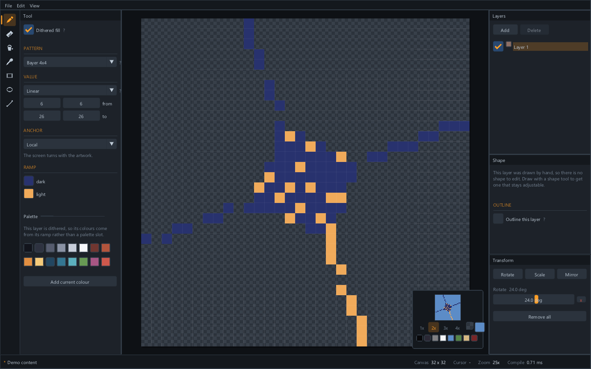
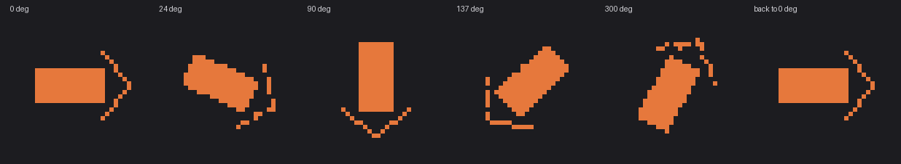
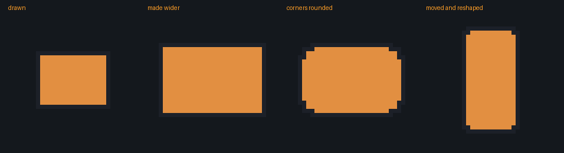
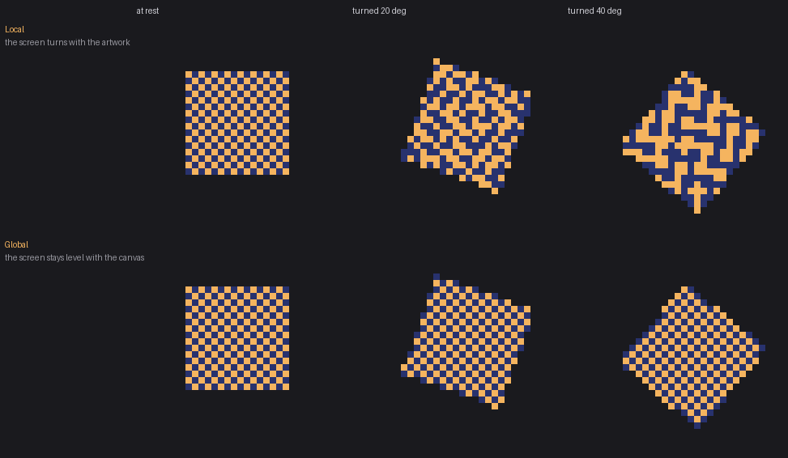

# Sprit's'fast

A lightweight sprite editor built on the [LiveSprite engine](https://github.com/wray2064/livesprite-engine).

Sprites are stored as mathematical operations rather than as pixels. A fill is a
standing rule about how a region gets its colour; a rotation is a parameter.
Pixels are compiled from that stack on demand, so nothing degrades no matter how
many times you change your mind.

Fast is the small editor that introduces the idea. **Sprit's'pract** is the full
production suite.



## Status

Early, but it is a real editor.

**Drawing** — pencil, spray, eraser, paint bucket, eyedropper, contour fill,
and rectangle, ellipse and line tools, with a hand and a zoom tool, all with
keyboard shortcuts; four inks for the pencil and spray -- simple, lock alpha,
replace colour, and **shading**, which steps each pixel to the neighbouring
palette slot, so a shaded area still follows the palette; any number of colours on one
layer, with a second colour on the right button and `X` to swap them; a brush
with a size, a round or square shape, and the pixel-perfect rule that keeps a
diagonal a line; pen tablets, with pressure driving the size and the eraser
end erasing. Symmetry across, down or both, about axes that start at the
middle and move; Shift+click for a straight line from the last stroke; Shift
keeps a rectangle square, an ellipse round and a line on fifteen-degree steps.
**Tiled mode** draws the canvas again beside itself, and a stroke off one edge
comes back on the other; a **tile grid** of any size and offset sits over the
pixel grid (or an **isometric** one of 2:1 diamonds), and **snap to grid** (`Shift+S`) makes marquees cover whole tiles,
shapes put their corners on tile lines, and a moved selection step tile to
tile.

**Text** that stays text: Fast's own five-by-seven pixel face, and a piece of
text is an element whose words, place and size are kept, so the Element panel
retypes it and the pixels are rebuilt from the words -- no erasing a typo.

**Selecting** — rectangle and ellipse marquees, a lasso and a magic wand, with
Shift to add, Alt to subtract and both to intersect; marching ants; select all,
deselect, reselect, invert; move the selected pixels by dragging or with the
arrows, flip and rotate them, cut, copy, paste and delete -- and the pencil,
eraser and bucket keep inside the selection while there is one. Copies go on
the **system clipboard** too, as PNG and as a bitmap with alpha, so they paste
into a browser, a chat or another editor; an image copied anywhere else pastes
into Fast as a float, one element per colour, and a colour the palette has
exactly comes in as that slot, so it recolours with the palette straight away.
A copied image can also be pasted as a reference, to draw from.

**The canvas** — canvas size with an anchor, crop to the selection, trim to
what is drawn, enlarge or reduce by a whole number, resize to any size or
percentage by nearest neighbour (shapes scaled as shapes), and turn or flip the
whole canvas -- every frame at once, one undo step each.

**Your keys, your defaults** — every shortcut is a named command, and
*Edit > Preferences* rebinds any of them by pressing the new keys, up to four
per command, with a warning where two commands share one and a reset per
command or for all. The menus show whatever keys you have. The same window
sets what a new document is, how often autosave writes, the undo depth, the
theme (slate, or paper for a bright room), and the canvas: the pixel grid's colour and opacity, and the chequer's colours
and square size. Both are plain text files in the settings folder
(`preferences.txt`, `keys.txt`), read as untrusted -- a hand-edited file can
make Fast odd, never broken.

**Layers** — blend modes, opacity, groups that composite as one, clipping,
locks, drag-to-reorder, copy and paste between frames, and a thumbnail per row;
a properties window per layer with a colour tag that stripes its row and notes
kept with it; and **reference layers** -- a sketch or a guide drawn like any
layer and shown on the canvas, but left out of every export and of the outline
round the whole figure.
One layer holds several elements: one per colour its pixels are painted in,
plus any shapes drawn onto it.

**Animation** — a frame strip with duplicate, delete and drag-to-reorder, a hold
per frame, named cycles with their own loop mode, playback at any speed, and an
onion skin with its range, tints, and neighbours taken from the cycle. Shift+click
selects a run of frames to duplicate, delete, reverse or give one hold, and Play
loops the run on its own.

**What makes it different** — shapes that stay editable after they are drawn,
outlines that follow the artwork and can trace a whole figure across layers,
non-destructive transforms, dithered fills with pattern anchoring, and palettes
whose slots recolour every layer that uses them — several per document, with a
one-key swap and a per-frame binding that gives colour cycling for nothing. A
shade strip under the palette offers the current colour's ramp, hue-shifted
the way pixel artists shade (darks toward blue, lights toward yellow), to paint
from or keep as slots.

**Files** — native Open and Save dialogs, recent files, drag-and-drop, atomic
saves, a prompt before anything discards unsaved work, autosave to a copy that
is never the file you are editing, and files that open from the command line.
**Tabs**: every file opened or made goes in a tab beside the work rather than
over it (a blank, untouched document is simply replaced), each with its own
history, selection, view and autosave copy; `Ctrl+Tab` steps through them,
`Ctrl+W` closes one, and quitting asks about each tab with unsaved work in
turn. A file already open is shown, not opened twice.
PNGs, GIFs (every frame), JPEGs and BMPs open as documents, their colours
becoming the palette; a sprite sheet slices into frames. Out: PNG at
whole-number scales, sprite sheets with a description beside them, and
animations as GIF, animated PNG, lossless animated **WebP** or a numbered PNG
sequence. The WebP encoder is Fast's own, written from the format's
specification: a palette transform with packed indices for sprites of 256
colours or fewer, and copies from the pixel before and the pixel above, which
is where pixel art repeats itself.

**Working from something** — import reference images that travel inside the
document, placed over or under the canvas at any opacity; and a library of two
folders, the sprites beside this one and the images you draw from, each a click
away.

```bash
build-gui/sprits_fast hero.lsprite
```

```bash
./build.bat test        # fast_core and its tests — no toolkit, seconds
./build-gui.bat         # the editor — fetches and builds SDL3, minutes
build-gui/sprits_fast
```

The core and the interface build separately on purpose. `fast_core` — the
document, undo history, tools and file handling — has no toolkit and no window,
so it can be tested without one and so the interface stays replaceable. Most of
the work happens there, and it builds in seconds.

`build/fast_smoke` drives a document end to end and prints what it sees at each
step, with no window at all.

### The stack

The layer panel has what every editor's has. **Blend modes** -- the engine's
eleven, from Multiply to Difference -- and **opacity**, on a layer or on a
whole group. **Order**: drag a row, or `Ctrl+]` and `Ctrl+[`. **Duplicate**
(`Ctrl+J`) makes a copy that is its own from the first stroke, and **Copy** and
**Paste** (`Ctrl+C`, `Ctrl+V`) carry a layer into any frame -- the paste is a
copy too, so the frames stay independent. **Groups** (`Ctrl+click` to select
several, `Ctrl+G`; drop a layer on a group's row to put it in; `Ctrl`+drop on
a layer to group the two; *Add to group* and *Remove from group* in the menu):
a group composites its layers into one picture and then blends that, which is
not the same as blending each layer, and is what a group is for;
`Ctrl+Shift+G` dissolves one in place. **Clip to below** draws a
layer only where the layer under it draws -- a highlight that stays inside
the body. **Lock** keeps the tools off a layer. Right-click a row for all of
it; every operation is one undo step.

Each row carries a thumbnail of what that layer alone draws, compiled on its
own and cached until it changes -- the engine tracks dirtiness per layer, so
editing one leaves the others' thumbnails alone. Hidden layers show faint.

Nothing here rasterises. A layer at Multiply is still the drawing it was, and
switching it back costs nothing. **Merge down** (`Ctrl+E`) keeps to the same
rule: a layer is a list of elements, so merging moves the upper layer's
elements into the one below, each still what it was -- a rectangle still a
rectangle, a colour still a slot -- with the upper layer's opacity and blend
folded into them so the picture does not change. Where folding would change
it (a transform or an outline that would then act on both, a hidden layer, two
blend modes at once) it is refused, and the reason is said.

### Autosave, and what survives a crash

Every couple of minutes, while there are unsaved changes and nothing is
mid-drag, a copy of the document goes into the settings folder. **It is never
written over the file you are editing.** That version of this feature loses
work rather than saving it: it destroys the last deliberate save, so "close
without saving" stops meaning anything and a mistake made at 11:59 is on disk
at 12:00 with no way back.

The copy is deleted when the document is saved properly, and when the program
closes normally. Which means **a copy still there at startup is proof the last
session ended badly** -- nothing has to record a crash, and nothing has to be
believed. Fast offers what it finds: *Open* loads it as an unsaved document,
so you choose where it really goes; *Discard* throws it away; *Later* leaves
it for next time. The copy carries the whole package, references included.

*File > Autosave* turns it off, sets the interval, or writes one now.

### References, and two libraries

**Import an image to draw from** -- a photograph, a sketch, a pose sheet --
and it sits over or under the canvas at whatever opacity you want. It changes
no pixel: no layer holds it, no operation names it, and exporting does not
know it exists. Place it by the numbers, press *Fit*, or hold **Alt** and drag
it on the canvas.

A reference **travels inside the document**. The alternative is a link to a
file on disk, which is a smaller file and a broken promise: move the work to
another machine, or tidy the folder the image came from, and the reference is
gone exactly when a half-finished drawing still needs it. Capped at 8 MB each
and 16 MB across the document, scaled down on import, and re-encoded as PNG,
so a photograph cannot quietly outweigh the artwork.

**The library** (`Ctrl+L`) is two folders. *Sprites* is the folder your work
lives in, listed with a picture of each file -- one click opens it, asking
about unsaved changes the way every other route does. *References* is a folder
of images to draw from; one click brings one into the document. A project here
is deliberately **just a folder**: no project file, nothing to corrupt, nothing
to keep in step with the filesystem, and one you made in Explorer already
works. Fast remembers only which folder, in its own settings, never in the
artwork.

The pictures come from a thumbnail written into each document on save, read
back through the package without opening the document -- so a folder of thirty
sprites is thirty entry reads rather than thirty full loads.

### Selecting, and moving what is selected

`M` is the marquee (`Shift+M` the ellipse), `Q` the lasso, `W` the magic wand
and `V` the move tool. Shift adds to the selection, Alt takes away from it, and
both keep only the overlap. A click without a drag lets go.

Drag inside a selection -- or anywhere, with the move tool -- and the pixels
lift and follow the pointer; with nothing selected the move tool takes the
whole layer. The arrows nudge a pixel, or eight with Shift. **Enter** drops
them, a click anywhere else drops them, and **Escape** puts them back as if
nothing happened. However long it was dragged and nudged for, a move is one
undo step.

What moves is the drawing, not a picture of it. The pixels of each colour
leave that colour's region and float as an element of their own at the top of
the layer -- a colour through a palette slot is still through the slot while it
floats -- and dragging them over other pixels on the layer does not eat those
pixels; only dropping does, the way it would in any editor. **A shape the
selection wholly contains goes along as a shape**: its geometry is moved, so
the rectangle is still a rectangle with a corner radius when it lands. `Shift+H`
and `Shift+V` flip the selection, and the Edit menu turns it by quarter turns;
the grid maps onto itself, so nothing is resampled.

`Ctrl+C`, `Ctrl+X` and `Ctrl+V` copy, cut and paste the selected pixels, colour
by colour, so a paste of pixels painted through a slot still follows the slot.
With nothing selected they copy and paste the layer, as before. Delete clears
the selected pixels. A layer with a transform on it refuses all of this: its
pixels are not canvas pixels, and the only way to make them so would be to
resample them.

### The canvas, turned and trimmed

The **Sprite** menu changes the canvas under every frame at once. In a bitmap
editor that means resampling every layer; here it means moving descriptions.
A region's runs move and a shape's corners move, by a mapping that sends a
pixel to a pixel -- so a quarter turn, a flip and an enlargement are exact, and
four turns give back the same bytes. A rounded rectangle on a canvas turned a
quarter is a rounded rectangle of the other proportions, not a picture of one.

**Canvas size** grows or shrinks the canvas about any of nine anchors, and a
smaller canvas **keeps what falls outside it**: those pixels are still in their
regions, just off the edge, and growing the canvas again brings them back.
**Crop to selection** and **Trim** (to the smallest rectangle anything is drawn
in, across every frame) are the same move. **Reduce** is the one lossy thing on
the menu -- it keeps one pixel of each block -- and says so.

### The brush, with a mouse or a pen

The pencil has a **size** (1 to 32, `Shift+]` / `Shift+[`), **round** or
square, and at one pixel the rule every pixel-art tool has: **pixel-perfect**,
which drops the corner of every L in a stroke so a diagonal reads as a line
rather than a staircase with doubled steps. The outline under the pointer is
the brush, so what a click covers is never a guess.

A pen tablet works as it is -- the stylus drives the pencil like a mouse.
Bring one near and the panel offers **pressure sets size**: a light touch is
one pixel, full pressure the size chosen. The pen's **eraser end erases** while
it touches and hands the tool back after, the way a pencil does. Pressure and
the eraser tip come from SDL's own pen events, read beside the mouse ones.

### Many colours on one layer, and every one of them a rule

Pick a colour and paint; pick another and paint beside it, on the same layer,
as in any pixel editor. The left button paints with the first colour, the
right button with the second, and `X` swaps them. Painting over a pixel
replaces its colour rather than stacking on it.

What is different is what a colour *is*. Each one a layer is painted in is an
element of its own -- the pixels in that colour, and the rule that colours
them -- so nothing is ever flattened into a bitmap. A colour taken from the
palette paints **through its slot**: edit the slot and every pixel painted with
it recolours, on every frame, from the drawing rather than over it. That is
Aseprite's indexed mode, except that the sprite never has to be converted to
get it, and a colour with no slot sits beside the slotted ones without anyone
having to choose. The eyedropper reads the slot back too, so a colour picked
off the canvas keeps painting through the palette.

The **Element** panel lists what a layer holds: one row per colour and one per
shape, each with a chip. Select a colour's row and it can be recoloured -- a
replace-colour that is a parameter, so it can be changed back -- pointed at the
current colour with *= current*, or switched to a dithered fill without
touching the drawing. A dithered row can be painted *into*, so the pencil lays
down the dither rather than a flat colour.

Shapes join the same list. A rectangle, a line and a few pixels drawn with
three tools land on one layer, each still its own thing: the shape tools draw in
the current colour, fresh paint lands over a shape rather than under it, and
the pencil never draws into a rectangle and turns it into pixels. *Each shape
on its own layer* in the tool panel brings back the old behaviour for anyone
who wants every shape listed in the stack.

### The palette

Every document has one. Colours are **roles** rather than values: a pixel
painted through a palette slot names the slot, and changing that slot recolours
everything using it on the next compile -- from the drawing, not over it.
Swapping a character's palette for a night version or a second team colour is
one edit, not a reselect and repaint.

Click a swatch to paint with it, right-click to put it on the right button,
double-click to change what the slot means, name it, or remove it -- with a
warning first if anything paints through it. A colour can also be a value of
its own, which is what files written before palettes existed hold.

**Dithers follow the palette too.** Each end of a dithered layer's ramp can be a
palette slot rather than a colour, so a palette swap recolours the shading with
everything else. That was not true until the engine let a ramp stop name a role;
before that, a dither -- which is most pixel art -- sat outside the palette and
got left behind.

**Several palettes, and the swap.** A document holds as many palettes as it
needs; the row at the top of the panel says which one every frame uses, and
`<>` (or `Ctrl+P`) steps to the next. That is the swap: the whole animation
recolours in one step, from the drawing. Under *Palettes* -- closed until you
need it -- each palette can be renamed, copied and deleted, and a frame can be
given a palette of its own. A frame with its own sits the swap out, which is a
flash frame; one palette per frame with the timeline is colour cycling, for
nothing. The slots shown are always the palette the current frame draws with,
so what you edit is what you see.

**Arranging a palette** is a palette edit like any other. Drag a swatch onto
another to move it, or **Sort** by hue, saturation or lightness: the order is
what the swatches show and what a save keeps, and no slot changes number, so
nothing painted through one notices. **Ramp** fills evenly spaced slots between
the left and right colours. **Adjust** turns the hue and pushes the saturation
and lightness of every slot at once -- a recolour of the whole sprite that can
be dragged back to exactly where it was. **Make every colour a slot** turns
every colour painted as a value of its own, on every frame, into a slot, after
which the palette recolours all of it. **Presets** are palettes generated for
Fast -- greys, one bit, hue ramps shaded toward blue and yellow -- so none
carries anyone else's licence; the famous ones load from their own files.

**Load** and **Save** take `.gpl` (GIMP, and what Aseprite reads and writes --
it keeps the slot names), `.hex` (what Lospec serves), `.pal` (JASC) and `.act`
(Photoshop's colour table); Load also reads a palette off any image. Loading replaces the
palette the frame uses, which is what loading a palette means everywhere else, and it recolours
a sprite drawn through slots -- the point of them. Both are treated as untrusted
input: a stray line is skipped rather than failing the file, and a value outside
0..255 is refused rather than clamped.

### Bringing work in

**Open** takes a PNG, a GIF, a JPEG or a BMP as readily as a `.lsprite`, and
drag-and-drop does too. The picture is taken apart by colour: every distinct
colour becomes a region of exactly its pixels with a fill that colours it, so
what opens is a drawing, not a flattened picture to paint over. When the whole
picture uses 256 colours or fewer -- which is to say, when it is pixel art --
those colours **become the palette**, in the order they first appear, and every
pixel paints through its slot: the first thing to do with a sprite from
somewhere else is recolour it by editing a swatch. A picture with more colours
keeps them as colours of their own; one with thousands is a photograph, and is
refused with the suggestion to import it as a reference instead.

**Aseprite files open as the work they are.** A `.aseprite` or `.ase` file comes
in with its layers -- names, opacity, visibility, blend, groups -- its frames
and their holds, its tags as cycles in the right direction, and its palette as
the palette. Raw, compressed and linked cels all land where they belong. In an
indexed sprite every index becomes its slot, so two indices that happen to share
a colour stay two slots, and recolouring a swatch recolours what Aseprite
painted with that index. What does not carry over is said rather than dropped:
tilemap layers, and the handful of blend modes the engine does not have, which
come in as the nearest one it does. Read from Aseprite's published format
description, and treated as untrusted input like every other file.

An animated GIF opens as frames, each held for as long as the GIF said. **File
-> Import sprite sheet** slices one image on a grid into frames, guessing the
grid from the sheet's shape and saying how many frames each guess makes before
anything is replaced. Transparency is kept as it was, including the partial
kind.

Saving an opened picture asks where the `.lsprite` goes: the image it came
from is never written over by a save.

### Getting work out

**File -> Export PNG** writes a picture at 1x through 16x. Scaling is pixel
duplication, never interpolation: a sprite at 4x is exactly four identical pixels
per side, because anything else defeats the point of the format.

Export compiles at `Export` quality rather than writing what is on screen, and
leaves the document untouched -- exporting is not saving.

**Indexed PNG** writes a colour table and one byte a pixel, with the palette's
slots in their order as the table's first entries: slot 3 is index 3. A game
that swaps palettes at run time swaps the table, and the sprite recolours the
way it does here. Colours painted as values of their own, and a clear entry
when one is needed, go after the palette's, so the slots never move.

**File -> Export animation** writes the selected cycle, in its loop mode, or
every frame: as a **GIF**, which plays everywhere; as an **animated PNG**,
which keeps every colour and every level of transparency exactly; or as a
numbered **PNG sequence**. A GIF holds 256 colours a frame and no partial
transparency, so a document that needs more gets a palette per frame, and one
frame with more than any palette holds is reduced -- and the status line says
so rather than letting it happen quietly. Every frame is byte-for-byte what
exporting that frame alone would give, at the same whole-number scale.

### The thing to try first

Draw something, add a **Rotate** in the Transform panel, and drag the angle.



That is one sprite at 0, 24, 90, 137, 300 and 0 degrees again. The last frame is
not *close to* the first, it is byte-for-byte identical — SHA-256 and all. In any
editor that resamples, five turns would have left it soft and chewed.

Nothing is spent because nothing accumulates: the rotation is an entry in the
layer's operation list, and every compile resolves it against the pixels that
were drawn, not against the last frame. Drag the slider through two hundred
angles and there is still exactly one operation. Set it back to zero, or delete
the entry, and the original returns exactly.

The same idea one control over: select a colour's row in the Element panel and
change it, and the drawing is not repainted. The colour lives on the fill rule
rather than in the pixels.

### From the command line

The exports are there without a window, for a build script:

```bash
sprits_fast --export hero.aseprite --to hero.gif --scale 4 --cycle walk
```

The output's extension says what is written: `.png` is one frame (`--frame N`),
or with `--sheet` a sprite sheet and its manifest (`--border`, `--spacing`, `--trim`, and
`--json hash` or `--json array` for Aseprite's JSON layouts), `--sequence` a file per step,
`--animated` an animated PNG; `.gif` is the animation; `.webp` is one frame,
or with `--animated` the animation, lossless; `.lsprite` is the
document itself, which is how an `.aseprite`, a PNG or a GIF is converted; and
`.gpl`, `.hex`, `.pal` or `.act` is the palette. The input is anything Open
takes. The exit code is 0 for success, and a failure says why.

### The corner preview

Working at 26x, you lose all sense of what the sprite reads like at the size it
will actually be seen. The preview shows it at 1x to 4x in the corner of the
canvas, and it costs nothing: it reuses the texture the canvas has already
uploaded rather than compiling the sprite a second time.

It is also the navigator. Zoomed in past the edges, the part the view shows is
outlined on it, and clicking or dragging there takes the view with it.

The background is the part that earns its keep. A sprite that reads perfectly on
the transparency chequer can vanish against sky blue or lose its outline against
black, and there is no way to find that out except to look. So there are eight
backdrops for the situations a sprite has to survive -- black, dark, grey, white,
sky, grass, sand, blood -- plus any colour you like. Which one is chosen is saved
with the file: a character for a night level should open against a dark one every
time.

Toggle it with **P**, or from the View menu.

### Frames, and a canvas that stays live

Press **T** for the strip, **Enter** to play, **,** and **.** to step, **O** for
onion skin. Space is the hand: hold it and drag to pan, as the middle button
does.

A frame is a sprite, and the document's sprite order is the timeline -- so there
is no second list to fall out of step with the first, and undo puts the frames
back without being told a timeline exists. Duplicating a frame copies the
drawing and shares the palette, which is why recolouring a slot recolours every
frame at once.

The reason this is affordable is worth stating, because the obvious answer is
the wrong one. Compiles here are **O(area)**: 0.14 ms at 32x32, 0.82 ms at
64x64, 3.9 ms at 128x128, and going from 4 layers to 32 moves 0.69 ms to 1.22 ms.
So the canvas is live synchronously and needs no background thread -- and a
thread would not have helped anyway, since a timeline showing eight frames is
eight compiles a frame whether they run on one core or four.

Instead each frame keeps its texture, and the engine is asked which frames
actually changed. Editing frame 3 costs one compile of frame 3; the strip, the
onion skin, the corner preview and playback are all textured quads over textures
that already exist. The status bar shows **compiles this frame**: zero at rest,
one while drawing. `--expect-idle` makes that a CI failure rather than a claim.

Playback is a function of elapsed time rather than a playhead that is stepped,
so a dropped frame costs nothing and scrubbing lands on exactly what playing
showed.

### Cycles

A cycle is a named run of frames -- "walk", "hurt" -- with its own loop mode, so
one plays once and another loops in the same document at the same time. They are
saved with the file.

The thing worth knowing is that a cycle is a **sequence, not a subset**. A step
names a frame, and two steps may name the same one, so a four-frame walk is drawn
once and played `0 1 2 1`. That is why the editor is a second row of steps rather
than a checkbox per frame: a checkbox cannot say a frame twice, and it cannot say
what order.

The strip stays connected to it -- a frame carries one dot per time the cycle
plays it, and a frame no step names is dimmed rather than flagged, because an
in-between kept for later is an ordinary thing to have.

### Sheets

**File → Export sheet** lays the frames into one image: a grid, a row or a
column, at any whole-number scale, from the selected cycle or from every frame.

The promise is that **a cell is byte-for-byte what exporting that frame alone
would have produced**, and it is not automatic. The engine can pin a pattern to
where a frame sits inside something larger, so compiling a frame for cell (2, 1)
rather than at the origin really does change its pixels. Every cell is therefore
compiled at the origin, and the other behaviour -- one dither running
continuously across the whole sheet -- is a tickbox rather than an accident. No
other editor can offer that choice at all, because in every other editor the
dither was baked into pixels long before the sheet existed.

A sheet of a cycle repeats a cell where the cycle repeats a frame, so it plays
correctly by stepping through its cells in order.

Beside the image goes a small `.json` naming every cell's position and hold, the
frame names and the cycles, so a consumer has more than a picture. The format is
versioned from its first line and is not stable yet. It can be written instead
in the **JSON Aseprite writes**, keyed or listed, which game-engine importers
built for Aseprite already read: cycles become frame tags wherever a cycle is a
run of cells. A border and spacing between cells keep a texture filter from
bleeding one frame into the next. **Trim** cuts every cell to the smallest
rectangle holding what any frame draws -- one rectangle for all, so the cells
still line up -- and the manifest says where it was cut from, as Aseprite's
`spriteSourceSize` does.

### Shapes that stay shapes

Drag out a rectangle with **R**, an ellipse with **U**, a line with **L**.
Click out a polygon corner by corner with **Shift+D**, and a curve with
**Shift+L**: click to place its points, drag as you place one to pull out its
handles, as in a vector editor. An open curve is drawn pixel-perfect, one pixel
wide with no doubled corners; closed, it is a filled shape with curved sides.



That is one rectangle. Drawn once, then widened, given rounded corners, then
moved and reshaped -- and the outline follows it every time, because the outline
is generated during the compile from whatever the layer draws rather than being
stamped in when you asked for it.

In every other pixel editor a shape becomes pixels the moment you release the
mouse. Getting it two pixels wider means undoing and drawing it again, and the
outline you added has to be redone as well. Here the rectangle is still a
rectangle an hour later: it still has an origin, a width and a corner radius,
and all three are in the Shape panel. **On the canvas**, the shape being edited
shows its handles -- a box's corners, a line's ends, a polygon's corners, a
curve's points and control points -- and dragging one reshapes it, in one undo
step, with everything built on it following.

A layer drawn freehand has no shape to edit, and the panel says so rather than
offering controls that would do nothing. The outline works on it regardless.

### Outlines that know what they are going round

Tick **Outline** in the Shape panel. It is generated during the compile from
whatever is drawn, so it follows the artwork instead of being stamped where the
artwork used to be.

The control that matters is what it traces. **This layer** draws a line round
what that layer draws, which is what one part of a character wants. **Whole
sprite** draws one line round the figure however many layers it is built from --
with no seam where two of them meet, and it follows whichever part moves.

Thickness, inside or outside, and a colour that can be a value or a palette slot.
A slot is the better answer when there is one: the outline then joins a palette
swap instead of being the one thing left behind by it.

### Dithering, and the pattern that stays put

Tick **Dithered fill** and the layer's colour rule becomes a dither: a value
compared against a threshold matrix, choosing between two ramp stops. Constant
density gives a classic two-tone screen; Linear, Radial or Angular vary the value
across the shape, which is how a gradient gets built out of dithered pixels.
Twelve prebaked patterns, all of them threshold matrices rather than one-bit
stamps -- which is why the same tile works at any density and at every step of a
gradient.

The control with no equivalent in a bitmap editor is **anchoring**:



Same drawing, same pattern, same rotation. On the top row the screen turns with
the artwork and the checkerboard falls apart, because a checker rotated off-axis
cannot stay a checker on a pixel grid. On the bottom it stays level with the
canvas and survives the turn intact.

In an editor that bakes dithering into pixels there is no choice to make: you get
the top row. Here it is a parameter, and switching it recompiles from the same
drawing. A third setting, **Fixed**, pins the screen to the canvas so the artwork
slides across it -- that one differs from Global only once the artwork *moves*,
so it does not show in a picture of something merely turning.

**One honest note.** Look at the arrowhead in that strip. Single-pixel diagonals
break into dashes at arbitrary angles — the solid body turns crisply, thin
features do not. That is a property of resolving coverage without
anti-aliasing, which is the right trade for pixel art, but it is worth seeing
before you rely on it.

## Where to start reading

[docs/handoff.md](docs/handoff.md) is the orientation: what is built against
the engine's specification, what every file is for, what is still open, and the
traps that have already cost time. [docs/architecture.md](docs/architecture.md)
is the reasoning behind the decisions, and [docs/testing.md](docs/testing.md)
is how this is checked, including the parts only a person at the window can
judge.

## Build

Requires CMake 3.20, a C++17 compiler, and the LiveSprite engine.

```bash
cmake -S . -B build -DCMAKE_BUILD_TYPE=RelWithDebInfo
cmake --build build
ctest --test-dir build
```

The engine is found in one of three ways, tried in order:

| Way | When |
|---|---|
| `-DLIVESPRITE_DIR=<path>` to a source checkout | Development. This is the default, pointing at the sibling directory |
| `find_package(LiveSprite)` | An installed engine |
| `-DLIVESPRITE_GIT_REPOSITORY=<url>` | A clean machine, pinned by tag |

The engine is referenced, never copied in. Two copies of a deterministic engine
means two sets of golden hashes that drift apart.

## How it is put together

```
src/app/       the document, undo, tools, palette, files — no interface at all
src/ui/        the interface: theme, panels, canvas, window
src/main.cpp   the smoke run, which has no window
third_party/   stb_image_write, vendored and pinned
tests/         what fast_core promises, checked without a window
```

`fast_core` is a separate library from anything that draws. Every tool, panel and
menu item goes through `fast::Document`, which owns an engine context and the
history of what has been done to it:

```cpp
doc.beginAction("Draw");
//  ... engine calls ...
doc.endAction();          // or abandonAction(), for a cancelled drag
```

That bracket is the only thing a tool has to remember. Undo is an in-memory
snapshot of engine state — about 0.1 ms — so it is taken per action without
thinking about the cost. Snapshots restore ids exactly, so handles the interface
is holding stay valid across an undo.

Files are LiveSprite packages (`.lsprite`): the document, plus whatever an
application keeps beside it. **Fast carries entries it does not understand
through a save unchanged**, so opening a file made by Pract and saving it does
not destroy Pract's data. There is a test for that, because it is the kind of
promise that quietly stops being true.

## Licence

Fast is **Apache-2.0**. Fork it, gut it, ship something better — that is what it
is for. Third-party components and their licences are listed in [NOTICE](NOTICE);
all of them were chosen so that none imposes anything on a fork.

Being open does not make the whole product open source: Fast depends on the
LiveSprite engine, which is **source-available under the Business Source License
1.1**, becoming Apache-2.0 four years after each version is published. Building
an editor on the engine — including a commercial one, including one that
competes with this — is explicitly allowed. See the engine's `LICENSING.md`.

That is stated here rather than left to be discovered later.
